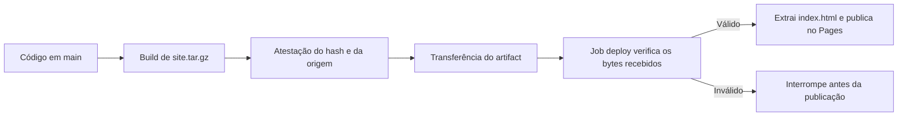

# Secure Release

Demonstração de um pipeline que só publica um site depois de verificar os bytes recebidos e a procedência do pacote. O projeto usa SHA-256, atestações do GitHub Actions com identidade OIDC e GitHub Pages.

**Site:** [luigischmitt.github.io/secure-release](https://luigischmitt.github.io/secure-release/) — Pages já está configurado; a publicação começa quando a PR #8 for incorporada.

## Fluxo



O pacote contém apenas `index.html`. O build o assina como arquivo de release; o job `deploy` baixa essa transferência e exige correspondência com o repositório `luigischmitt/secure-release`, o workflow `.github/workflows/release.yml`, `refs/heads/main` e o commit da execução. Só então lê o arquivo regular esperado e o envia ao Pages. A permissão `pages: write` existe apenas no job `deploy`.

## Repetir a demonstração

### Build local

```sh
./scripts/build-site.sh
tar -tzf site.tar.gz
shasum -a 256 site.tar.gz
```

O pacote deve listar somente `index.html`. Para repetir o experimento didático de hash, altere uma cópia do arquivo, reempacote e compare os digests. O hash detecta a mudança, mas não identifica quem escolheu ou publicou o hash.

### Workflow

O GitHub Pages já está configurado para usar GitHub Actions. Depois que a PR #8 entrar em `main`, cada push nessa branch fará o build, a atestação, a verificação e o deploy. Para executar manualmente, abra **Actions → Build and attest site → Run workflow**, selecione `main` e escolha um caso:

| `test_case` | Resultado esperado |
| --- | --- |
| `normal` | Verificação aprovada e publicação. |
| `tampered-package` | O pacote é alterado depois da assinatura; o digest não confere e a publicação é ignorada. |
| `without-attestation` | A atestação é omitida; a verificação falha e a publicação é ignorada. |
| `wrong-provenance` | O pacote é assinado, mas a referência exigida não confere; a publicação é ignorada. |

Para uma verificação local, baixe `site-package` de uma execução e use o SHA exato daquela execução:

```sh
gh run download <RUN_ID> \
  --repo luigischmitt/secure-release \
  --name site-package \
  --dir release

gh attestation verify release/site.tar.gz \
  --repo luigischmitt/secure-release \
  --signer-workflow luigischmitt/secure-release/.github/workflows/release.yml \
  --source-ref refs/heads/main \
  --source-digest <COMMIT_SHA_DA_EXECUCAO>
```

Obtenha o commit com `gh run view <RUN_ID> --repo luigischmitt/secure-release --json headSha --jq .headSha`.

## Evidência já registrada

A [execução 36476423665](https://github.com/luigischmitt/secure-release/actions/runs/36476423665) gerou e verificou uma atestação pública. O SHA-256 de `site.tar.gz` foi `07b0a52435b49ec8a8d46582b1baadef0dc72ae4813d6a828760ac7b816e344d`; a origem identificou o repositório, o workflow, `refs/heads/main` e o commit `b6fe2d3f2cbad8e0e87b833691b94bcf8c1441d1`. A rejeição de pacote adulterado, pacote sem atestação e referência incorreta também passou em verificações locais. Os links das execuções integradas e a versão do Pages serão acrescentados depois que a sequência de PRs for incorporada e executada.

A execução [36481167768](https://github.com/luigischmitt/secure-release/actions/runs/36481167768) validou o caminho positivo do job `verify`: SHA-256 `be7dc0294885088e7260b1bffa9345da66c5284c4e6fd73c477351e0379f4777`, referência `refs/heads/main`, commit `4bc97454cc6af861e6ff36266e034f67aeeaefe7`. A verificação local do pacote baixado também passou com repositório, workflow, referência e commit exigidos. As execuções de publicação e rejeição integradas ainda dependem da PR #8.

## O que a atestação garante

- SHA-256 identifica os bytes do pacote; uma alteração muda o digest.
- A assinatura e o certificado OIDC associam esse digest ao workflow autorizado.
- A política também confere repositório, referência e commit.
- A atestação não prova que o código é benigno. Uma alteração maliciosa já aceita em `main` pode ser assinada pelo workflow autorizado.

Por isso, proteja `main` contra alterações diretas e não autorizadas. O estado atual do repositório não tem ruleset nem proteção de branch.

## Materiais do projeto

- [Plano das etapas e roteiro de 9 minutos](PLAN.md)
- [Modelo de ameaça, especificação e evidências](SPEC.md)
- [Apresentação do seminário](seminario/secure-release-apresentacao-v2.pptx)
- [GitHub Docs: artifact attestations](https://docs.github.com/en/actions/concepts/security/artifact-attestations)
- [GitHub Docs: workflows customizados do Pages](https://docs.github.com/en/pages/getting-started-with-github-pages/using-custom-workflows-with-github-pages)
