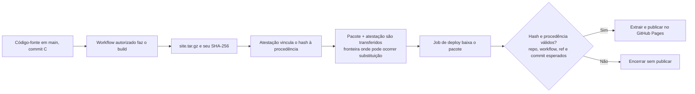

# Secure Release — spec inicial

**Status:** em implementação, atualizado em 28/09/2026. Repositório público e GitHub Pages escolhido como destino.

## Objetivo

Publicar uma aplicação web estática pequena no GitHub Pages somente depois de verificar criptograficamente o artifact gerado pelo pipeline. A entrega deve mostrar, na prática, a diferença entre conferir um hash e confiar na origem de um arquivo assinado.

## Contexto da disciplina

O enunciado do seminário pede uma equipe de duas pessoas, uma implementação prática de uma técnica ou ferramenta de criptografia e uma apresentação remota de 9 minutos em 30/09/2026. Ele sugere três partes: apresentação do problema (2 min), modelagem e conceitos (2,5 min) e demonstração (4,5 min). Essas divisões são uma sugestão do documento.

O capítulo 2 de Stallings fundamenta a escolha: a seção 2.2 apresenta hash e integridade; a 2.3, criptografia de chave pública; e a 2.4, assinatura digital e certificados. O artifact é público. A propriedade que buscamos é detectar alteração e verificar a procedência, não ocultar seu conteúdo.

## Etapa 1 — modelo de ameaça e regra de confiança

### Propriedades de segurança

- **Integridade:** detectar se os bytes de `site.tar.gz` foram alterados. A verificação compara o hash do pacote recebido com o hash coberto pela atestação.
- **Autenticidade e procedência:** confirmar que a atestação foi produzida pela identidade esperada do workflow deste repositório. Um hash, sozinho, não identifica quem escolheu ou publicou esse hash.
- **Confidencialidade:** não é um objetivo deste projeto. O site e o pacote são públicos; não precisamos ocultar seu conteúdo.

### Fluxo e fronteira de confiança

O instante de interesse é a passagem do pacote do job de build para o job de deploy. O build bem-sucedido só prova que o job terminou; o job de deploy precisa verificar os bytes que recebeu, pois é esse pacote que será publicado.



### Adversário e política

O adversário da demonstração consegue substituir ou alterar `site.tar.gz` depois do build e antes da publicação. A política aceita o pacote somente quando a atestação é válida, seu hash corresponde aos bytes baixados e a procedência corresponde a:

- repositório `luigischmitt/secure-release`;
- workflow de release autorizado, planejado em `.github/workflows/release.yml`;
- referência `refs/heads/main`;
- commit `github.sha` da mesma execução que produziu o pacote.

O job de deploy verifica o pacote baixado, antes de extrair arquivos ou iniciar a publicação. O workflow e os valores efetivamente verificados serão conferidos quando o Actions for implementado.

| Caso | Decisão esperada | Motivo |
| --- | --- | --- |
| Pacote original, bytes e procedência esperados | Aceitar | Hash, assinatura e identidade atendem à política. |
| Pacote alterado após a atestação | Rejeitar | O hash dos bytes recebidos não corresponde ao hash atestado. |
| Pacote trocado junto com um novo checksum sem atestação autorizada | Rejeitar | Quem troca os dois valores não prova a identidade do produtor aprovado. |
| Código ou workflow autorizado comprometido antes de gerar a atestação | Fora do que esta regra impede | O produtor legítimo pode atestar conteúdo malicioso; a proteção depende de controlar mudanças em `main` e no workflow. |

**Limite:** a atestação prova integridade e procedência segundo a identidade configurada. Ela não prova que o conteúdo é benigno nem protege contra comprometimento do código-fonte autorizado, do workflow, das permissões administrativas ou da infraestrutura de confiança.

## Escolha da técnica

| Técnica | O que demonstraria | Adequação ao projeto |
| --- | --- | --- |
| SHA-256 isolado | Mudança no conteúdo | Se alguém substitui o arquivo e o hash publicado junto, o receptor não sabe quem produziu ambos. |
| HMAC | Integridade e autenticação com segredo compartilhado | Exigiria distribuir e proteger o mesmo segredo nos lados de build e deploy. |
| Assinatura digital com atestação | Integridade e identidade verificável do produtor | Corresponde ao problema de release e permite associar o artifact a repositório, workflow e commit. |

O GitHub implementa a terceira opção com Sigstore e atestações de procedência. A verificação precisa conferir também a identidade esperada; uma assinatura matematicamente válida de outra origem não autoriza um deploy. O GitHub descreve atestações básicas como SLSA Build Level 2, sem que isso signifique que o artifact seja seguro para executar.

## Proposta de MVP

**Artifact:** `src/index.html` é o arquivo-fonte da página. O script `scripts/build-site.sh` copia a página para `dist/index.html` e cria `site.tar.gz`, contendo somente `index.html` na raiz do pacote. A versão visível nesta primeira página é `0.1.0`. O pacote completo é o objeto de release.

### Etapa 2 — aplicação e artifact

A página mínima está em `src/index.html`. Para gerar a saída de publicação e o pacote, execute `./scripts/build-site.sh`. A saída `dist/` contém `index.html`; a listagem de `site.tar.gz` também contém apenas `index.html`. Portanto, a versão `0.1.0` que aparece na página é exatamente a versão incluída no pacote criado nesta etapa. Os artefatos gerados `dist/` e `site.tar.gz` são ignorados pelo Git.

### Etapa 4 — workflow de atestação

O workflow `.github/workflows/release.yml` usa `workflow_dispatch` e só executa o job de build quando a referência selecionada é `refs/heads/main`. Ele chama o mesmo `scripts/build-site.sh`, gera a atestação de `site.tar.gz` com `actions/attest`, e envia esse arquivo como artifact chamado `site-package` para o job seguinte. As actions são fixadas em SHAs completos correspondentes a releases versionadas.

As permissões do workflow são vazias por padrão. O job de build recebe `contents: read` para checkout, `id-token: write` para obter a identidade OIDC que a assinatura precisa, `attestations: write` para persistir a atestação e `artifact-metadata: write` para o registro de artifact. O job não recebe permissões de publicação no Pages.

**Assinatura:** usar a atestação de artifact do GitHub Actions (`actions/attest`). Ela associa o SHA-256 do pacote à procedência do build e é assinada por uma identidade do workflow, sem gerenciar uma chave privada permanente no repositório.

**Destino:** GitHub Pages. A publicação consome apenas os arquivos extraídos do pacote que acabou de passar pela verificação.

**Site:** uma página HTML estática. Ela reduz o trabalho de frontend e mantém o pacote assinado como unidade de release. O Pages publicará o conteúdo extraído desse pacote depois da verificação.

**Fluxo:**

1. Uma execução de release iniciada na branch principal constrói `site.tar.gz`.
2. O job de build gera a atestação desse pacote e o envia como artifact da execução.
3. Um job separado baixa o pacote e chama `gh attestation verify` antes de extrair ou publicar qualquer conteúdo.
4. A verificação exige o repositório, o workflow assinante, o commit e a referência esperados para aquela execução. Falha ou ausência de atestação interrompe o job.
5. Depois da verificação, o mesmo job `deploy` prepara os arquivos do site e faz o deploy no GitHub Pages. O job de build não recebe permissão para deploy.

O arquivo assinado é o pacote. Depois de verificar os bytes recebidos no próprio job de deploy, o workflow lê somente o `index.html` regular esperado e o envia ao Pages. O Pages cria seu pacote de transporte a partir desse arquivo. Nenhuma etapa de build ou transformação do site ocorre depois da verificação.

**Execução comprovada em 28/09/2026:** [run 36476423665](https://github.com/luigischmitt/secure-release/actions/runs/36476423665) terminou com sucesso na referência `refs/heads/main`, commit `b6fe2d3f2cbad8e0e87b833691b94bcf8c1441d1`. O pacote `site.tar.gz` tinha SHA-256 `07b0a52435b49ec8a8d46582b1baadef0dc72ae4813d6a828760ac7b816e344d`. `gh attestation verify` aceitou o pacote exigindo o repositório `luigischmitt/secure-release`, o assinante `.github/workflows/release.yml`, a referência e o commit. O certificado foi emitido para a identidade OIDC do GitHub Actions e o timestamp foi verificado no log público de transparência Sigstore. Esses dados são evidência desta execução; novos builds produzem outro digest e outro commit.

### Etapa 5 — barreira de verificação

O segundo job baixa `site-package` em diretório novo, exige que `site.tar.gz` seja o único arquivo e imprime seu SHA-256 para facilitar a inspeção dos logs. Antes de extrair ou transformar o pacote, executa:

```sh
gh attestation verify incoming/site.tar.gz \
  --repo "$GITHUB_REPOSITORY" \
  --signer-workflow "$GITHUB_REPOSITORY/.github/workflows/release.yml" \
  --source-ref "$GITHUB_REF" \
  --source-digest "$GITHUB_SHA"
```

Na etapa 5, o job de verificação recebeu apenas `attestations: read`. Na etapa 6, esse mesmo job tornou-se `deploy` e recebeu também `contents: read`, `pages: write` e `id-token: write`, necessários para publicar. O job `build` continua sem permissões de Pages. Como o job termina com erro se a assinatura, o hash ou qualquer campo de procedência não corresponder, os passos de extração e publicação são ignorados após uma rejeição.

**Execução positiva em Actions:** [run 36481167768](https://github.com/luigischmitt/secure-release/actions/runs/36481167768) terminou com sucesso para `refs/heads/main`, commit `4bc97454cc6af861e6ff36266e034f67aeeaefe7`. O artifact baixado teve SHA-256 `be7dc0294885088e7260b1bffa9345da66c5284c4e6fd73c477351e0379f4777`; o job de verificação aceitou pacote, atestação e procedência. A prova integrada dos cenários negativos será registrada depois que a PR #8 colocar o job `deploy` no `main`.

### Etapa 6 — publicação no GitHub Pages

O workflow inicia tanto por `workflow_dispatch` quanto por push em `main`. O job `deploy` baixa o pacote da execução, verifica primeiro hash e procedência, e só então lê o membro regular `index.html`; ele não extrai nomes de arquivo fornecidos pelo tar. O `actions/upload-pages-artifact` prepara a entrada do Pages e `actions/deploy-pages` publica nesse mesmo job. Somente `deploy` recebe `pages: write` e `id-token: write`; o job `build` não pode publicar.

A fonte do Pages foi configurada como `workflow` em 28/09/2026 pela API do GitHub. Depois que a PR #8 for incorporada, o endereço e a versão publicada serão registrados aqui.

### Etapa 7 — cenários de rejeição

No evento manual, o input `test_case` permite repetir quatro casos sem editar o código:

| Opção | O que o workflow faz | Resultado esperado |
| --- | --- | --- |
| `normal` | Atesta, transfere, verifica e publica o pacote normal. | Sucesso e nova publicação. |
| `tampered-package` | Altera os bytes do pacote depois da atestação e antes do upload. | `gh attestation verify` falha pelo digest; extração e publicação não rodam. |
| `without-attestation` | Pula a criação da atestação e transfere o pacote. | A verificação falha por ausência de atestação; publicação não roda. |
| `wrong-provenance` | Mantém o pacote assinado, mas verifica contra uma referência de origem incorreta. | A verificação rejeita a procedência; publicação não roda. |

Os cenários negativos são apenas para execução manual e não alteram o caminho normal de `push` em `main`. Após cada falha, comparar a página com a última versão aprovada e conferir nos logs que os passos de extração, upload do artifact do Pages e deploy foram ignorados.

**Verificação local em 28/09/2026:** o pacote da execução 36476423665 passou com os quatro valores esperados. Uma cópia com bytes anexados depois da atestação e um arquivo de amostra sem atestação foram rejeitados por não terem uma atestação para seus digests. O pacote original com `--source-ref refs/heads/not-main` foi rejeitado porque a procedência declarava `refs/heads/main`. Ainda falta confirmar no Actions que os passos de publicação são ignorados e que o site mantém a versão anterior; isso exige incorporar a PR #8 e executar os modos negativos.

## Modelo de confiança

- **Integridade:** alterar um byte do pacote muda seu hash e faz a verificação falhar.
- **Autenticidade/procedência:** a verificação aceita somente a identidade do workflow e a origem esperadas, além da assinatura válida.
- **Controle de publicação:** o passo de deploy fica após a verificação no job que possui a permissão de Pages.
- **Limite:** uma assinatura válida não prova que o código do site é benigno. A regra depende de proteger a branch principal e o workflow de build contra alterações não autorizadas.

## Registro da etapa 3 — experimento com SHA-256

No pacote local `site.tar.gz` criado para esta demonstração, `shasum -a 256` registrou:

| Amostra | SHA-256 | Resultado |
| --- | --- | --- |
| Pacote original, com a página `0.1.0` | `d3671dadf8406fce36232334c83ee172781693f20fcbec49de5ee5b37b6c2d2a` | Hash de referência desta execução local. |
| Cópia reempacotada após trocar `0.1.0` por `9.9.9` | `f2a2c29f0775ba27641ef098e3e739ec807685c5d6f6b25dd71ec47013513c41` | Digest diferente; os bytes do pacote foram alterados. |

Ao comparar a cópia adulterada com o checksum original, `shasum -a 256 -c` retornou `FAILED`. Depois, ao substituir também o arquivo de checksum pelo digest da cópia adulterada, o mesmo verificador retornou `OK`. Isso demonstra que um checksum detecta divergência em relação ao valor confiado, mas não autentica esse valor: quem consegue trocar o pacote e o checksum pode fazer ambos corresponderem.

Essa evidência se relaciona à seção 2.2 de Stallings: o hash identifica os bytes e torna alterações observáveis. A seção 2.4 acrescenta a assinatura digital, que vincula o hash à chave/identidade do assinante. No projeto, a atestação do GitHub fornece essa ligação e a procedência do workflow; a política verifica a identidade autorizada antes de permitir o deploy. Os digests acima registram apenas o pacote local desta execução e devem ser recalculados sempre que o pacote for recriado.

## Critérios de aceitação

1. Um pacote produzido pelo workflow esperado passa pela verificação e chega ao Pages.
2. Uma cópia adulterada do mesmo pacote falha na verificação.
3. Um pacote sem atestação, ou atestado por uma origem diferente da política, não chega ao deploy.
4. Os logs tornam visíveis o hash do artifact, a origem verificada e o resultado do bloqueio.
5. A demonstração cabe em 4,5 minutos usando execuções preparadas de antemão e uma verificação feita ao vivo.

## Etapas de implementação e aprendizado

| Etapa | Conceito | O que vamos construir e comprovar |
| --- | --- | --- |
| 1. Modelo de ameaça | Qual arquivo é confiável e onde ele pode ser trocado | Desenhar o fluxo `build → artifact → verificação → deploy` e definir a política de origem. |
| 2. Artifact | Arquivo-fonte, saída de build e pacote de release | Gerar o site e criar `site.tar.gz`, que contém somente `index.html`. |
| 3. Hash | SHA-256 identifica bytes, mas não identifica sozinho o autor | Calcular o hash, adulterar uma cópia e observar a limitação de substituir pacote e checksum juntos. |
| 4. Assinatura e procedência | Identidade OIDC do workflow, certificado e commit | Atestar o pacote no Actions, verificar com `gh attestation verify` e inspecionar o resultado. |
| 5. Bloqueio do deploy | Verificação falha antes de liberar a publicação | Separar build e deploy em jobs, conceder a permissão de Pages apenas ao segundo e testar sucesso/falha. |
| 6. Publicação e apresentação | Evidência observável do controle | Abrir o site publicado, conferir o commit apresentado e ensaiar a demonstração. |

Em cada etapa, primeiro explicamos o conceito, depois implementamos uma parte pequena e por fim provocamos um caso de falha para entender o limite da proteção.

### Roteiro para 9 minutos

1. **0–2 min:** apresentar o risco de substituir um artifact depois do build e a diferença entre hash e assinatura.
2. **2–4,5 min:** mostrar o fluxo e explicar o que a verificação confere: bytes, assinatura e origem.
3. **4,5–9 min:** abrir o Pages, mostrar uma execução aprovada, verificar o pacote original ao vivo, adulterar uma cópia e mostrar a falha. Ter também uma execução de falha já preparada para mostrar que o deploy foi bloqueado, sem depender da duração do Actions durante a aula.

Depois do MVP, podemos estudar assinatura direta com Cosign, imagens de container, políticas de ambiente e outros metadados de cadeia de suprimentos.

## Plano de execução

O passo a passo de implementação, aprendizado e preparação da apresentação está em [PLAN.md](PLAN.md).

## Fontes

- Material do seminário fornecido pelo aluno, `seminario criptografia.pdf`.
- Stallings e Brown, *Segurança de Computadores*, capítulo 2: <https://www.kufunda.net/publicdocs/Seguran%C3%A7a%20de%20Computadores%20%28WILLIAM%20STALLINGS%29.pdf>.
- GitHub Docs, [Artifact attestations](https://docs.github.com/en/actions/concepts/security/artifact-attestations) e [Using artifact attestations](https://docs.github.com/en/actions/how-tos/secure-your-work/use-artifact-attestations/use-artifact-attestations).
- GitHub Docs, [Manually running a workflow](https://docs.github.com/en/actions/how-tos/manage-workflow-runs/manually-run-a-workflow) e [Workflow syntax](https://docs.github.com/en/actions/reference/workflows-and-actions/workflow-syntax).
- GitHub Actions, [`actions/attest` v4.2.1](https://github.com/actions/attest/releases/tag/v4.2.1), [`actions/checkout` v7.0.1](https://github.com/actions/checkout/releases/tag/v7.0.1) e [`actions/upload-artifact` v7.0.1](https://github.com/actions/upload-artifact/releases/tag/v7.0.1).
- GitHub CLI, [`gh attestation verify`](https://cli.github.com/manual/gh_attestation_verify).
- GitHub Docs, [Deploying your website automatically](https://docs.github.com/en/get-started/start-your-journey/deploying-your-website-automatically).
- GitHub Docs, [Configuring a publishing source for GitHub Pages](https://docs.github.com/en/pages/getting-started-with-github-pages/configuring-a-publishing-source-for-your-github-pages-site).
